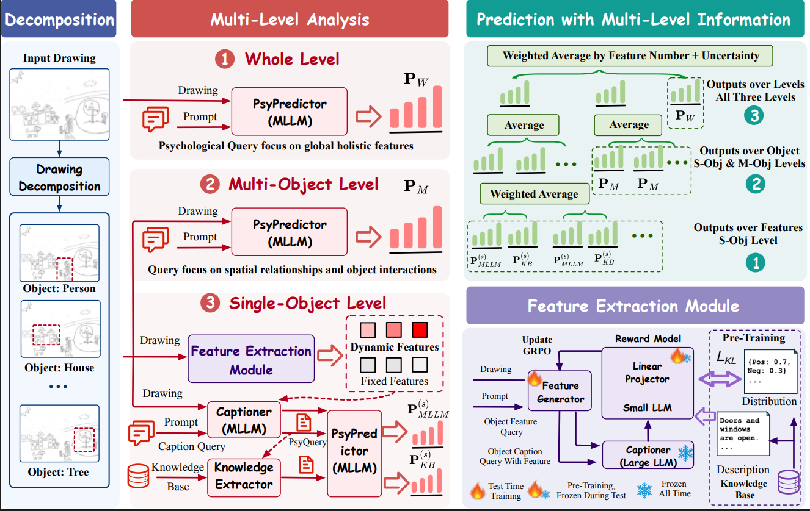

# PICK
Repository for "Reasoning Like Experts: Leveraging Multimodal Large Language Models for Drawing-based Psychoanalysis"

## Abstract
Multimodal Large Language Models (MLLMs) have demonstrated exceptional performance across various objective multimodal perception tasks, yet their application to subjective, emotionally nuanced domains, such as psychological analysis, remains largely unexplored. In this paper, we introduce PICK, a multi-step framework designed for Psychoanalytical Image Comprehension through hierarchical analysis and Knowledge injection with MLLMs, specifically focusing on the House-Tree-Person (HTP) Test, a widely used psychological assessment in clinical practice. First, we decompose drawings containing multiple instances into semantically meaningful sub-drawings, constructing a hierarchical representation that captures spatial structure and content across three levels: single-object level, multi-object level, and whole level. Next, we analyze these sub-drawings at each level with a targeted focus, extracting psychological or emotional insights from their visual cues. We also introduce an HTP knowledge base and design a feature extraction module, trained with reinforcement learning, to generate a psychological profile for single-object level analysis. This profile captures both holistic stylistic features and dynamic object-specific features (such as those of the house, tree, or person), correlating them with psychological states. Finally, we integrate these multi-faceted information to produce a well-informed assessment that aligns with expert-level reasoning. Our approach bridges the gap between MLLMs and specialized expert domains, offering a structured and interpretable framework for understanding human mental states through visual expression. Experimental results demonstrate that the proposed PICK significantly enhances the capability of MLLMs in psychological analysis. It is further validated as a general framework through extensions to emotion understanding tasks.

 

## Setup
### Requirements
Run **`pip install requirements.txt`**
### File and Package Required
Download the knowledge base to the current directory [knowledge_base_with_embeddings_soft_label_cleaned.csv](https://drive.google.com/file/d/1X635yCg1x9sbyRZRSjKGcBsEPFqTOFi-/view?usp=drive_link).

### GRPO Training
Run **`./train_PICK.sh`**

### Test
Run **`./test_PICK.sh`**

## 📚 Citation

